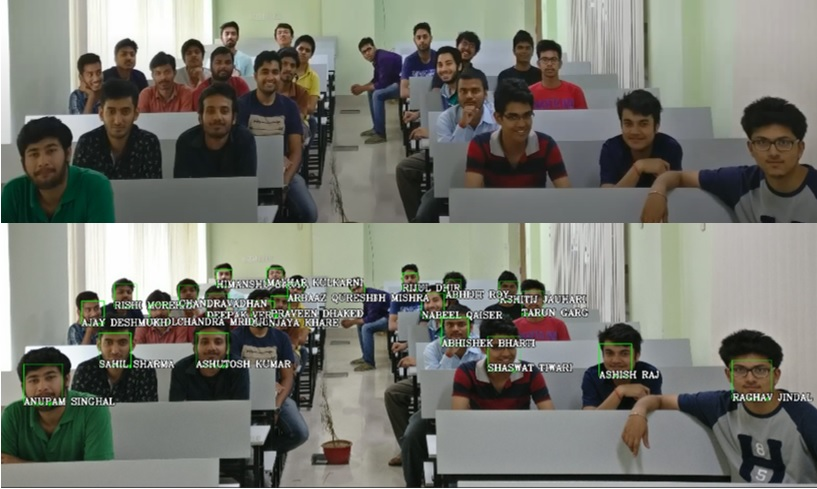
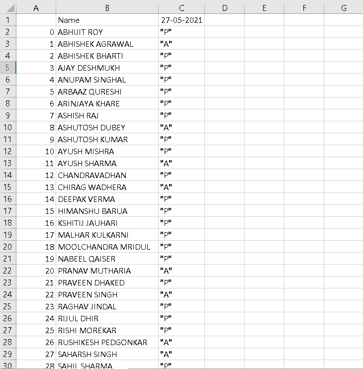

# FACE RECOGNITION-ATTENDANCE PROJECT

Project about marking attendance through face recognition in Python

## Working

The model first takes the encodings of faces from the dataset store in "imgAttendance2" file and compare that encodings to the detected faces from the test img and then if its match it recognizes and make a new excel sheet "AfterAttendance" where the attendance is marked.

## libraries used

- OpenCV
- Dlib
- Cmake
- Face_Recognition
- numpy
- Pandas

## Results

## Running the model in your system

To run this model in your system make sure to install all the libraries and then run the "AttendanceProject1.py" file you can check all the test img given in the repository by changing the img variable in the code for each image

You can make your own dataset as well just add your clear photo with your name as the file name in the empty folder "imgAttendance" file and then run the "AttendanceProject.py"and the model will detect your face through facecam

## Reference

[Click here to know more](https://medium.com/@ageitgey/machine-learning-is-fun-part-4-modern-face-recognition-with-deep-learning-c3cffc121d78)
